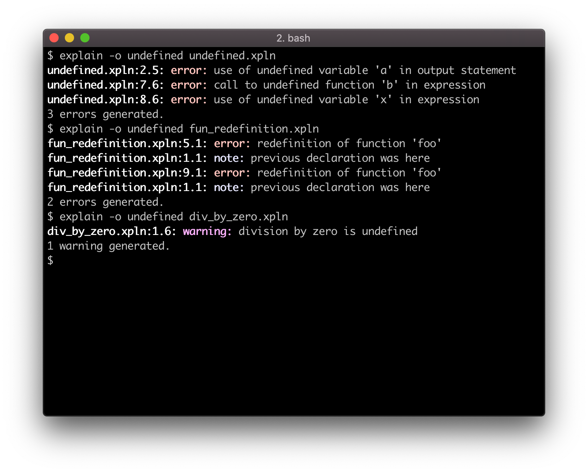

# explain

explain is an _industrial grade_ compiler for [XPLN]. It is built using `flex`, `bison` and LLVM.

[XPLN]: https://github.com/bozsahin/ceng444/blob/master/project-material/xpl-specs-fall2018.pdf

## Features

* Detailed error reporting with source locations, error recovery during parsing
* Optimizations (global value numbering, CFG simplification, instruction combining, constant folding and propagation,
etc.)
* Pretty-printer for the abstract syntax tree
* Option to emit LLVM intermediate representation
* Native code generation for X86, X86-64, PowerPC, PowerPC-64, ARM, MIPS and many more architectures

## Requirements

The project was built using the following tooling, earlier versions are not tested:

* CMake >= 3.13
* C++ compiler with C++14 core language support (gcc >= 5.1 or Clang >= 3.5)
* Boost >= 1.60
* `flex` >= 2.5
* `bison` >= 3.2
* LLVM >= 7.0.0

## Build

    $ mkdir build
    $ cd build
    $ cmake .. && make

On macOS, the CMake script will issue a warning about the installed Bison version. Make sure that Bison 3.2 (or greater)
is used when building this project.

## Usage

After compiling, install `explain` somewhere in your path. To see all available options, invoke `explain` with `--help`.

    $ explain --help
    explain, the industrial grade XPLN compiler

    General options:
      -h [ --help ]          print this help message and exit
      -v [ --version ]       print version and exit
      -i [ --input ] arg     input file
      -o [ --output ] arg    output file
    
    Debugging options:
      --trace-scan           run scanner in debug mode
      --trace-parse          run parser in debug mode
    
    Stage selection options:
      --emit-ast             emit AST in pretty-printed form
      --emit-llvm            emit LLVM representation only
      -c                     generate object file
    
    If no stage selection option is specified, then every stage will be run and
    the linker is run to produce an executable.

## Examples

### convert: A tour of `explain` by converting °F to °C

This example is located at `examples/convert.xpln`.

    fun convert(fahr)
        return (fahr - 32) * 5 / 9;
    endf;
    
    while 1 > 0
        input fahr;
        result := convert(fahr);
        output result;
    endw;
    
    return 0;

Compile with `explain` and run:

    $ explain convert.xpln -o convert
    $ ./convert
    100
    37.777778
    ^C

If you would like to link to a separate C/C++ program, invoke `explain` with `-c` to emit an object file. Note that the
top-level function is named `xpln_main` and a function defined with the name `main` in XPLN programs is mangled (their
new name would be `xpln_mangled_main`.)

    $ explain convert.xpln -o convert.o -c
    $ cat > driver.c
    #include <stdio.h>
    
    extern double convert(double);

    int main(int argc, char **argv)
    {
        printf("100 F is approx. %.2lf C\n", convert(100.0));

        return 0;
    }
    ^D
    $ cc -o driver driver.c convert.o 
    $ ./driver
    100 F is approx. 37.78 C

If you would like to emit LLVM code, you can do so by using `--emit-llvm`. You can then use this file with other
programs in the LLVM toolchain (`llc`, `opt`, `llvm-as`, etc.) for fun and profit.

    $ explain convert.xpln -o convert.ll --emit-llvm
    $ cat convert.ll
    ; ModuleID = 'convert.xpln'
    source_filename = "convert.xpln"
    target datalayout = "e-m:o-i64:64-f80:128-n8:16:32:64-S128"
    target triple = "x86_64-apple-darwin18.0.0"
    
    @ifmt = internal constant [4 x i8] c"%lf\00"
    @ofmt = internal constant [5 x i8] c"%lf\0A\00"
    
    declare i32 @scanf(i8*, ...)
    
    declare i32 @printf(i8*, ...)
    
    define double @convert(double %fahr) {
    entry:
      %0 = fadd double %fahr, -3.200000e+01
      %1 = fmul double %0, 5.000000e+00
      %2 = fdiv double %1, 9.000000e+00
      ret double %2
    }
    
    define double @xpln_main() {
    entry:
      %fahr = alloca double, align 8
      br label %cond
    
    cond:                                             ; preds = %cond, %entry
      %0 = call i32 (i8*, ...) @scanf(i8* getelementptr inbounds ([4 x i8], [4 x i8]* @ifmt, i64 0, i64 0), double* nonnull %fahr)
      %fahr1 = load double, double* %fahr, align 8
      %1 = call double @convert(double %fahr1)
      %2 = call i32 (i8*, ...) @printf(i8* getelementptr inbounds ([5 x i8], [5 x i8]* @ofmt, i64 0, i64 0), double %1)
      br label %cond
    }
 
To obtain a pretty-printed form of the abstract syntax tree after some basic manipulations, invoke `explain` with the
`--emit-ast` flag.

    $ explain examples/fibonacci.xpln -o fibonacci.ast --emit-ast
    $ cat fibonacci.ast
    fun fib
      args
        arg n
      if
        or
          ==
            n
            0
          ==
            n
            1
      then
        return
          1
      else
        return
          +
            call fib
              args
                arg
                  -
                    n
                    1
            call fib
              args
                arg
                  -
                    n
                    2
    
    fun xpln_main
      args
      return
        call fib
          args
            arg
              10

### stress: General education & stress test for XPLN compilers

This stress test was written by me to challenge other students of Ceng444 to test their compilers against mine. It
features:

* function definition and call with 64 arguments
* case-insensitive identifiers
* function definition and call with a very long name (>1024 chars)
* trivially optimizable deep nesting (constant propagation and dead code elimination test)
* iterative implementation of the factorial
* recursive implementation of Fibonacci numbers
* iterative calculation of Pi
* iterative implementation of the Euclidean algorithm for finding the GCD of two numbers
* iterative algorithm for the modulo operator
* recursive implementation of exponentiation by squaring

`explain` produced a **15512 byte x86-64 executable in 0.122 seconds**, and the **program runs in 0.467 seconds**,
producing the following output:

    65.000000
    42.000000
    2432902008176640000.000000
    832040.000000
    3.141593
    101.000000
    2.000000
    3269017.372472
    
Here is a line-by-line breakdown of the expected results:

* 64 + 1
* Just 42
* Factorial of 20
* 30th Fibonacci number
* Pi, calculated using the Gregory-Leibniz series with 100,000,000 iterations
* Greatest common divisor of 50500 and 100899
* Remainder of the division 100 / 7
* e to the 15th power

The stress test files can be found under `examples/stress` within this repository. The outputs were obtained by the
following series of invocations:

    $ explain stress.xpln -o stress.ast --emit-ast
    $ explain stress.xpln -o stress.ll --emit-llvm
    $ llc -o stress_mips.s -march=mips stress.ll
    $ llc -o stress_x86_64.s -march=x86-64 stress.ll
    
### errors: Compiler diagnostics, error reporting and recovery

All of the following examples are under `examples/errors`.

`explain` outputs diagnostics where it can. These scenarios include the following:

* syntax errors (`bad_tokens.xpln`, `recover.xpln`)
* argument count mismatch in function definition and function call (`arg_count.xpln`)
* argument redefinition (`arg_repeat.xpln`)
* division by zero (`div_by_zero.xpln`)
* redefinition of function (`fun_redefinition.xpln`)
* missing return statements (`return_missing.xpln`)
* usage of undefined variables and functions (`undefined.xpln`)
* LLVM function & module verifier errors

The diagnostic output is colored and contains source location information. See the image below:

## Contributing

If you feel like hacking `explain`, feel free to open a pull request. If you implement any of the following features
you'd be saving me a lot of time!

* Highlighting errors like `clang` does
* Support for the DWARF debugging standard
* Support for different optimization levels, and more agressive optimizations like function inlining
